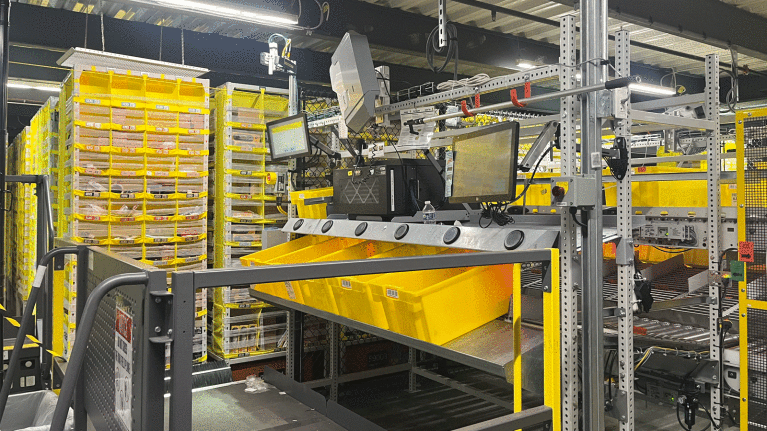
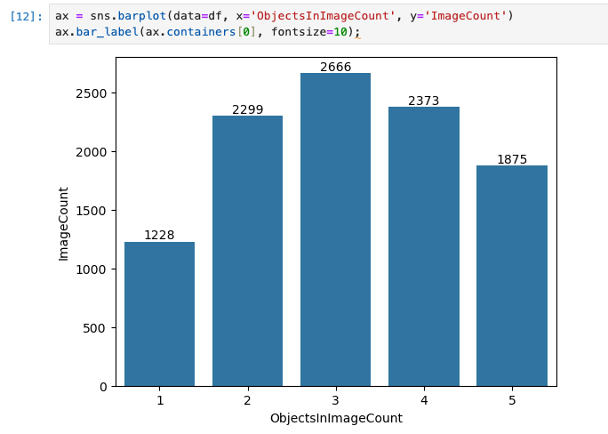
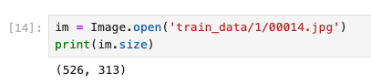

# Capstone Proposal

## Domain Background

Purchasing products online and getting them delivered to your house door has never been faster and simpler from a customer perspective than today.

This increase in simplicity for the customer however lead to an increase in complexity of the order fulfillment process, demanding all actors to constantly optimize their steps to be faster, cheaper and more reliable.

One important actor in the order fulfillment process is the distribution center where products get picked, packed, and eventually shipped to the customer.

These distribution centers are highly automated and therefore rely on robotics and computer vision. In the distribution center items need to be sorted, stored, moved and packed. Typically the items are not handled directly but put into boxes for standardized handling. 

For example at the pick station, a human is taking specific, i.e. items of a particular order from a larger container and puts them in a smaller yellow box:

_Image taken from https://www.aboutamazon.com/news/operations/amazon-fulfillment-center-photo-tour_

At this step a validity check where computer vision might help is to ensure that the number of objects in the box matches the number of items from the customer order.

To understand more about the end-to-end process I recommend having a look at https://www.aboutamazon.com/news/operations/amazon-fulfillment-center-photo-tour

From a machine learning perspective this is a very challenging task. Earlier research focused on counting/identifying objects of a specific class in a given image, e.g. detect all cars in a given image.

In the distribution center we will however have millions of unique items. On the other hand most might have a cuboid  similar shape, which could make the problem simpler. 

Well-known datasets in that area have only few classes, e.g. the [PASCAL VOC](http://host.robots.ox.ac.uk/pascal/VOC/) has only 20 classes. Another newer dataset in this context is [COCO](https://cocodataset.org/#home) which contains 91 object types and is used for evaluation of state-of-the are models.

## Problem Statement

(Cost-) efficicency is a key objective for distribution. Therefore a lot of processes are automated and executed by robots. The problem at hand is out of this domain and one of possibly many quality assurance checks.

> Count the objects in a bin to compare the count with the expected number of objects (e.g. items ordered)

Technically this translates to a computer vision problem, where we need to identify and count objects in a given image.

## Solution Statement

Since object detection is a complex task, training a model from scratch is not very promising given the available budget and time. Instead I will use a pretrained model and fine-tune on the given task, where the model should tell how many objects are in an image with an upper bound of 5 objects per image.

I will usea pretrained ResNet50, a convolutional neural network that is 50 layers deep and has been trained on more than a million images from the ImageNet database. I will adapt the model, so that on the ouput layer I have 5 neuros only.

I will train on Amazon SageMaker, using the [PyTorch Estimator]( https://sagemaker.readthedocs.io/en/stable/frameworks/pytorch/sagemaker.pytorch.html)

I will then perform hyperparameter optimization to improve the model.

## Datasets and Inputs

A subset of the [Amazon Bin Image Dataset](https://registry.opendata.aws/amazon-bin-imagery/) to stay within the provided budget has been provided. This contains 10441 images, where each image contains 1 to 5 objects. The count of objects in an image, will serve as the label.

This is an example of an image containing 1 object:

I will need to resize the images since the have a different shape then expected by ResNet50 (expects 224 x 224)

From the picture it becomes clear that this is quite a hard task, since it is already challenging as a human to get the count of objects right.

I will follow the standard approach of splitting the images in a training, validation and test set.

## Benchmark Model

One well performing object detector is [YOLOv7](https://arxiv.org/abs/2207.02696) which was trained on the COCO dataset and achievs an accuracy of 56.8%. Another well performing object detector is [Single Shot MultiBox Detector](https://arxiv.org/abs/1512.02325) which is also used by the Amazon SageMaker built-in object detection algorithm [Object Detection - MXNet](https://docs.aws.amazon.com/sagemaker/latest/dg/algo-object-detection-tech-notes.html) and achieves a 72.1% mAP on VOC2007.

## Evaluation Metrics

I will use accuracy, which is the ratio of the number of correct predictions to the total number of predictions made, as main evaluation metric.

## Project Design

1. Prepare the data and split it into the training, validation and testing set
2. Upload to S3 so that I can make it available to SageMaker training jobs.
3. Write the scripts which will be passed to SageMaker. 
   * Define the model (which will be a `torchvision.models.resnet50(pretrained=True)`) 
   * Define the data loaders which perform resizing, augmentation and normalization
   * Define the training loop 
   * Define the testing loop
4. Submit a SageMaker training job
5. Evaluate the results
   
