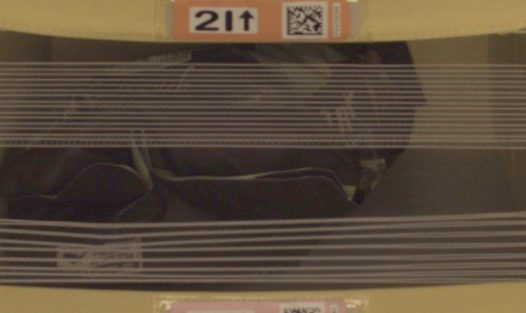

# Capstone Proposal

## Domain Background

Purchasing products online and getting them delivered to your house door has never been faster and simpler from a customer perspective than today.

This increase in simplicity for the customer however lead to an increase in complexity of the order fulfillment process, demanding all actors to constantly optimize their steps to be faster, cheaper and more reliable.

One important actor in the order fulfillment process is the distribution center where products get picked, packed, and eventually shipped to the customer.

## Problem Statement

(Cost-) efficicency is a key objective for distribution. Therefore a lot of processes are automated and executed by robots. The problem at hand is out of this domain and one of possibly many quality assurance checks.

> Count the objects in a bin to compare the count with the expected number of objects (e.g. items ordered)

Technically this translates to a computer vision problem, where we need to identify and count objects in a given image.

## Solution Statement

Since object detection is a complex task, training a model from scratch is not very promising given the available budget and time. Instead I will use a pretrained model and fine-tune on the given task, where the model should tell how many objects are in an image with an upper bound of 5 objects per image.

I will use ResNet50, a convolutional neural network that is 50 layers deep and has been trained on more than a million images from the ImageNet database.

I will then perform hyperparameter optimization to improve the model.

## Datasets and Inputs

A subset of the [Amazon Bin Image Dataset](https://registry.opendata.aws/amazon-bin-imagery/) to stay within the provided budget has been provided. This contains 10441 images, where each image contains 1 to 5 objects. The count of objects in an image, will serve as the label.

Number of objects in image | Count of images which n objects
--- | ---
1 | 1228
2 | 2299
3 |	2666
4 |	2373
5 |	1875

This is an example of an image containing 1 object:

From the picture it becomes clear that this is quite a hard task, since it is already challenging as a human to get the count of objects right.

I will follow the standard approach of splitting the images in a training, validation and test set.

## Benchmark Model

As benchmark model I plan to use a simpler ResNet18 model.

## Evaluation Metrics

I will use accuracy, which is the ratio of the number of correct predictions to the total number of predictions made, as main evaluation metric.