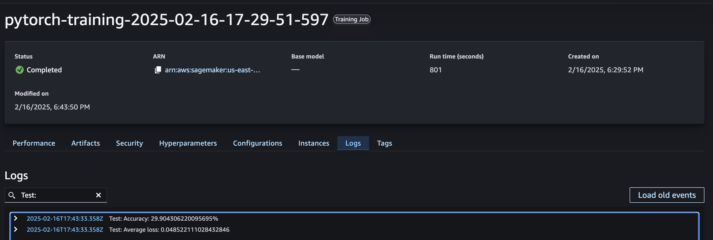
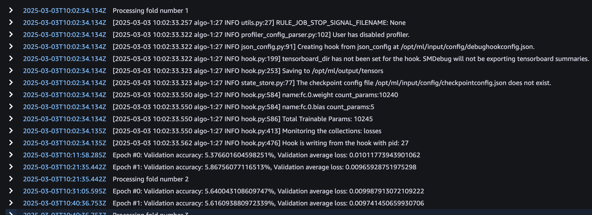
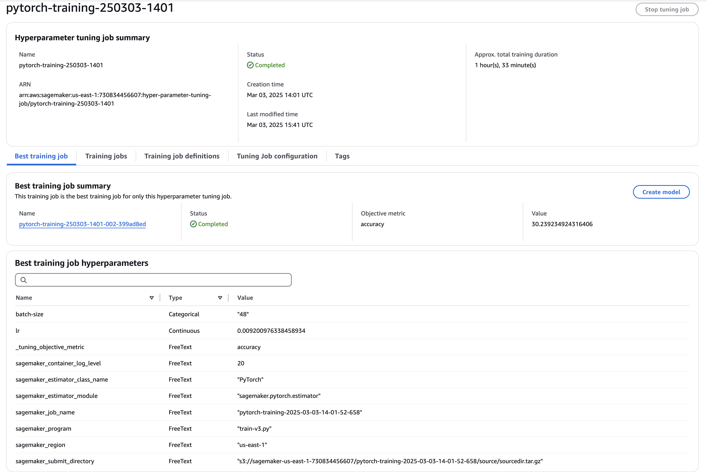

# Capstone Project Report

## Definition

### Project Overview

Purchasing products online and getting them delivered to your house door has never been faster and simpler from a customer perspective than today.

This increase in simplicity for the customer however lead to an increase in complexity of the order fulfillment process, demanding all actors to constantly optimize their steps to be faster, cheaper and more reliable.

One important actor in the order fulfillment process is the distribution center where products get picked, packed, and eventually shipped to the customer.

These distribution centers are highly automated and therefore rely on robotics and computer vision. In the distribution center items need to be sorted, stored, moved and packed. Typically the items are not handled directly but put into boxes for standardized handling. 

For example at the pick station, a human is taking specific, i.e. items of a particular order from a larger container and puts them in a smaller yellow box:


_Image taken from https://www.aboutamazon.com/news/operations/amazon-fulfillment-center-photo-tour_

At this step a validity check where computer vision might help is to ensure that the number of objects in the box matches the number of items from the customer order.

To understand more about the end-to-end process I recommend having a look at https://www.aboutamazon.com/news/operations/amazon-fulfillment-center-photo-tour

From a machine learning perspective this is a very challenging task. Earlier research focused on counting/identifying objects of a specific class in a given image, e.g. detect all cars in a given image.

In the distribution center we will however have millions of unique items. On the other hand most might have a cuboid  similar shape, which could make the problem simpler. 

Well-known datasets in that area have only few classes, e.g. the [PASCAL VOC](http://host.robots.ox.ac.uk/pascal/VOC/) has only 20 classes. Another newer dataset in this context is [COCO](https://cocodataset.org/#home) which contains 91 object types and is used for evaluation of state-of-the are models.

### Problem Statement

(Cost-) efficicency is a key objective for distribution. Therefore a lot of processes are automated and executed by robots. The problem at hand is out of this domain and one of possibly many quality assurance checks.

> Count the objects in a bin to compare the count with the expected number of objects (e.g. items ordered)

Technically this translates to a computer vision problem, where we need to identify and count objects in a given image.

### Metrics

I will use accuracy, which is the ratio of the number of correct predictions to the total number of predictions made, as main evaluation metric.

## Analysis

### Data Exploration


A subset of the [Amazon Bin Image Dataset](https://registry.opendata.aws/amazon-bin-imagery/) to stay within the provided budget has been provided. This contains 10441 images, where each image contains 1 to 5 objects. The count of objects in an image, will serve as the label.


This is an example of an image containing 1 object:


I will need to resize the images since the have a different shape then expected by ResNet50 (expects 224 x 224)


From the picture it becomes clear that this is quite a hard task, since it is already challenging as a human to get the count of objects right.

I will follow the standard approach of splitting the images in a training, validation and test set.

### Algorithms and Techniques

When it comes to image processing one can differentiate image classification, object detection and semantic segmentation.

* The problem at hand is an __image classification__ task since we one to output one label (i.e. the number of objects) per image.
* It is not an __object detection__ task since we don't want to classify objects in a given image, but rather just detect and count objects.
* It is also not a __semantic segmentation__ task since we don't need to tag individual pixels.

Convolutional Neural Networks have emerged as a very successfull approach for image classification tasks. Famous models have been published over the last decades like __LeNet-5__ in 1995, __AlexNet__ in 2011 and __ResNet__ in 2025, which added improvements over the time. 

__ResNet__, the model I will be using, introduced the concept of skip/residual connections that allows the output of earlier layers to skip some layers and be added directly to the output of later layers. This addressed the problem of vanishing gradients and enabled this training of much deeper architectures.

### Benchmark

One well performing object detector is [YOLOv7](https://arxiv.org/abs/2207.02696) which was trained on the COCO dataset and achievs an accuracy of 56.8%. Another well performing object detector is [Single Shot MultiBox Detector](https://arxiv.org/abs/1512.02325) which is also used by the Amazon SageMaker built-in object detection algorithm [Object Detection - MXNet](https://docs.aws.amazon.com/sagemaker/latest/dg/algo-object-detection-tech-notes.html) and achieves a 72.1% mAP on VOC2007.

## Methodology

### Data Preprocessing

The starter script downloads all images into one folder per class. For the training process I need at least to split the images into two sets, one for testing and for training. For this I am using the `train_test_split` function from `sklearn.model_selection`, splitting the data set into 80% for training and 20% for testing

```
x_train, x_test = train_test_split(file_names, test_size=0.2, random_state=42)
```

which results in the following numbers of images

```
1228 for class 1 have been split into 982 images for train and 246 images for test
2299 for class 2 have been split into 1839 images for train and 460 images for test
2666 for class 3 have been split into 2132 images for train and 534 images for test
2373 for class 4 have been split into 1898 images for train and 475 images for test
1875 for class 5 have been split into 1500 images for train and 375 images for test
```

Since I am using a pretrained model, I want to perform the same preprocessing steps on my data as the ones which were used to get to the pretrained model

From https://pytorch.org/vision/0.19/models/generated/torchvision.models.resnet50.html#torchvision.models.resnet50

> Accepts PIL.Image, batched (B, C, H, W) and single (C, H, W) image torch.Tensor objects. The images are resized to resize_size=[256] using interpolation=InterpolationMode.BILINEAR, followed by a central crop of crop_size=[224]. Finally the values are first rescaled to [0.0, 1.0] and then normalized using mean=[0.485, 0.456, 0.406] and std=[0.229, 0.224, 0.225]

This can be implemented in code using the [`torchvision.transforms`](https://pytorch.org/vision/0.19/transforms.html) module:

```
train_transform = transforms.Compose([
    transforms.Resize((256, 256)),
    transforms.RandomResizedCrop((224, 224)),
    transforms.RandomHorizontalFlip(0.2),
    transforms.RandomVerticalFlip(0.2),
    transforms.RandomRotation(5),
    transforms.ToTensor(), # ToTensor scales to range [0.0, 1.0]
    transforms.Normalize([0.485, 0.456, 0.406], [0.229, 0.224, 0.225])
])
```

### Implementation

The implementation can be found in `train-v1.py`

In the `net` function I am specifying the model which is a pretrained Resnet50. 

```
model = models.resnet50(pretrained=True)
```

As I only want to update the final layer I am freezing all weights:

```
for param in model.parameters():
    param.requires_grad = False
```

For the final layer I want to train I need 5 output neurons, since the model shall be able to count between 1 and 5 objects in a given image.

```
num_features = model.fc.in_features
model.fc = nn.Sequential(
    nn.Linear(num_features, 5)
)
```

In the `create_data_loaders` function I am creating one `torch.utils.data.DataLoader` for training and one for testing.
The one for training uses the data available in the subfolders of path `s3://svme-sagemaker-udacity-d123dwe2d/train_data` and the one for testing the data available in the subfolers of path `s3://svme-sagemaker-udacity-d123dwe2d/train_data`. There is one subfolder per class, containing only images of the respective class.

The DataLoader also performs the transformations mentined in the section above. The difference between the transformations for training and testing is that only for training data augmentation is performed, so the transformations for training additionally include these lines 

```
    transforms.RandomResizedCrop((224, 224)),
    transforms.RandomHorizontalFlip(0.2),
    transforms.RandomVerticalFlip(0.2),
    transforms.RandomRotation(5),
```

The implementation of the `train` function is pretty straight forward.
For every epoch the function processes the training data in batches:

* Make a prediction on the batch data
* Calculate the loss (predicted value is the outcome of the prior step, actual value comes with the training data)
* Calculate the gradients to 
* Eventually update the weights

```
def train(model, train_loader, criterion, optimizer, epochs):
    for epoch in range(epochs):
        
        model.train()

        for batch_data, batch_target in train_loader: 
            optimizer.zero_grad() # reset gradients
            batch_pred = model(batch_data) # forward pass
            batch_loss = criterion(batch_pred, batch_target) # calculate loss 
            batch_loss.backward() # calculate gradients
            optimizer.step() # update weights

        model.eval()
    
    return model

```

With the hyperparameters set to 

* batch_size: `32`
* epochs: `1`
* lr: `0.0016`

I got the following results

```
2025-02-16T17:43:33.358Z Test: Accuracy: 29.904306220095695%
2025-02-16T17:43:33.358Z Test: Average loss: 0.048522111028432846
```


### Refinement

My first idea was to implement k-fold cross validation so that I could train for much more epochs, but use early stopping to prevent overfitting. The implementation can be found in `train-v2.py`

The main difference is in the `train` function. Instead of a `torch.utils.data.DataLoader` the `torchvision.datasets.ImageFolder` is passed as argument.

With this I can create folds in the train method
``` 
skf = StratifiedKFold(n_splits=k_folds, shuffle=True, random_state=42)
```
iterate over the folds
```
for fold, (train_ids, validation_ids) in enumerate(skf.split(np.zeros(len(targets)), targets)):
```
and create a `torch.utils.data.DataLoader` containing only data from the fold.
 
 ```
train_subsampler = SubsetRandomSampler(train_ids) 
train_loader = DataLoader(train_dataset, batch_size=batch_size, sampler=train_subsampler)

validation_subsampler = SubsetRandomSampler(validation_ids) 
validation_loader = DataLoader(train_dataset, batch_size=batch_size, sampler=validation_subsampler)
```
while the rest stays quite similar to `train-v1.py`.

However the accuracy did not look promising at all, which I suspect is also due to the even smaller training size with this approach.
.

My next idea was to perform hyperparameter optimization. The implementation can be found in `train-v3.py`.

The search space was 

```
hyperparameter_ranges = {
    'lr': ContinuousParameter(0.001,0.01),
    'batch-size': CategoricalParameter([16, 32, 48])
}
```

After running 4 jobs 


these parameters were best

```
batch_size = 48
lr = 0.009200976338458934
```

## Results

### Model Evaluation and Validation


The best accuracy I achieved is 30.24% which I think is not too bad given the small training set.
With more budget and time gathering more training data would be my top priority to try increasing the accuracy.

Due to available budget I was only running 2 epochs, although it is more common to start with around 25 epochs when fine-tuning a ResNet-50 model.

### Justification

When creating the project proposal I came accross these models 
* [YOLOv7](https://arxiv.org/abs/2207.02696) which was trained on the COCO dataset and achievs an accuracy of 56.8%. 
* [Single Shot MultiBox Detector](https://arxiv.org/abs/1512.02325) which is also used by the Amazon SageMaker built-in object detection algorithm [Object Detection - MXNet](https://docs.aws.amazon.com/sagemaker/latest/dg/algo-object-detection-tech-notes.html) and achieves a 72.1% mAP on VOC2007.

To get to a more robust model my first focus would be on gathering more training data.